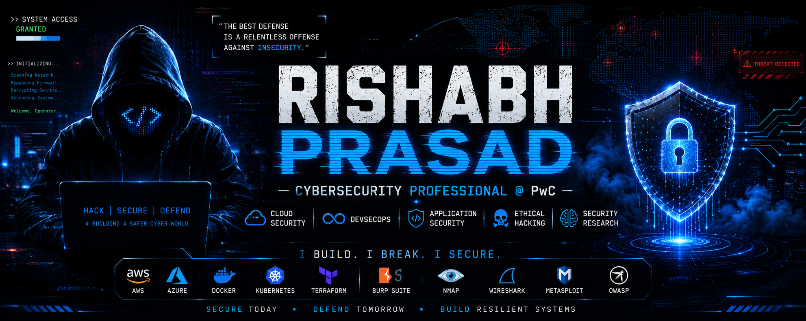

<p align="center">
  
</p>

<p align="center">
  
</p>

<p align="center">
  <a href="https://linkedin.com/in/YOUR-LINKEDIN">
    
  </a>

  <a href="mailto:YOUR_EMAIL@gmail.com">
    
  </a>

  

  
</p>

---

# 🛰️ Operator Profile

```yaml
Operator        : Rishabh Prasad
Current Role    : Cybersecurity Professional @ PwC
Status          : 🟢 ACTIVE
Focus           : Cloud Security
Specialization  : DevSecOps | Application Security | Ethical Hacking
Research        : Security Engineering
Learning Mode   : ENABLED
Open Source     : ACTIVE
Mission         : Build Secure Cloud-Native Systems
Location        : India 🇮🇳
```

---

# ⚡ Security Arsenal

## ☁️ Cloud

<p>

</p>

## 💻 Development

<p>

</p>

## 🔐 Security Toolkit

| Offensive | Defensive |
|------------|-----------|
| Burp Suite | OWASP Top 10 |
| Metasploit | Secure SDLC |
| Nmap | Threat Modeling |
| Gobuster | IAM |
| Hydra | Security Monitoring |
| Wireshark | Cloud Security |

---

# 🎯 Current Operations

| Mission | Progress |
|---------|:--------:|
| ☁️ Cloud Security | ███████░░░ 70% |
| 🔥 DevSecOps | ██████░░░░ 60% |
| 🔐 Application Security | ███████░░░ 70% |
| ⚔️ Ethical Hacking | ████████░░ 80% |
| 🤖 AI Security | ████░░░░░░ 40% |
| 📚 Security Research | █████░░░░░ 50% |

---

# 🚀 Active Deployments

| Project | Status |
|---------|--------|
| 🟢 TechFixNow | Production |
| 🟡 AI Intrusion Detection System | Research |
| 🟡 Cloud Security Labs | Building |
| 🟢 Burp Suite Labs | Active |
| 🟢 Metasploit Labs | Active |
| 🟡 DevSecOps Pipeline | In Development |

---

# 🧠 Intelligence Lab

## Current Research Areas

- ☁️ Cloud Security
- 🔐 Zero Trust
- 🔥 DevSecOps Automation
- 🤖 AI for Cybersecurity
- 📡 Threat Detection
- 📦 Container Security
- 🌐 IoT Security
- 🧪 Security Automation

---

# 🎖️ Mission Objectives

- [ ] CEH
- [ ] Security+
- [ ] PNPT
- [ ] AWS Certified Security – Specialty
- [ ] AZ-500
- [ ] Kubernetes Security
- [ ] Publish Research Paper
- [ ] Open Source Security Tool
- [ ] Security Conference Speaker

---

# 📊 Live Telemetry

<p align="center">


</p>

<p align="center">


</p>

---

# 🏆 Achievements

<p align="center">


</p>

---

# 📈 Contribution Graph

<p align="center">


</p>

---

# 📫 Connect With Me

<p align="center">

<a href="https://linkedin.com/in/YOUR-LINKEDIN">

</a>

<a href="mailto:YOUR_EMAIL@gmail.com">

</a>

</p>

---

<p align="center">

### ⚡ Secure • Automate • Research

*"Think like a defender. Build like an engineer. Learn continuously."*

</p>
